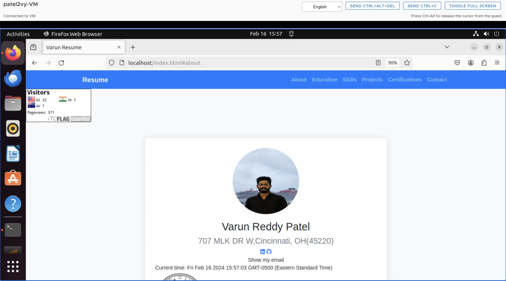
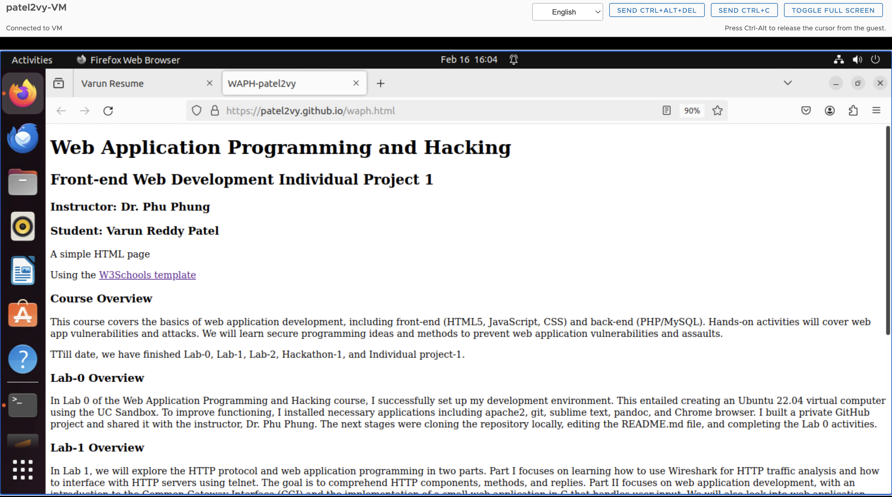
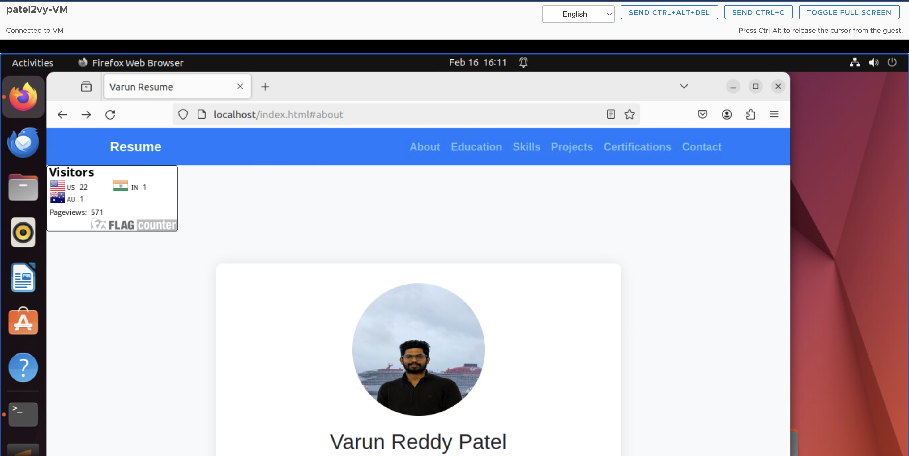
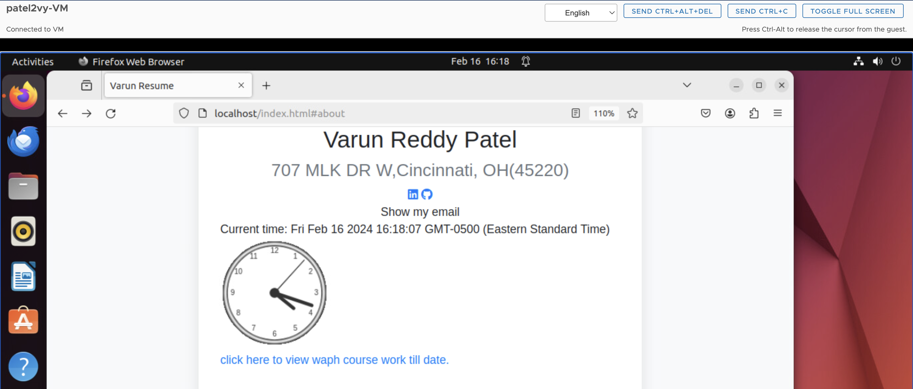
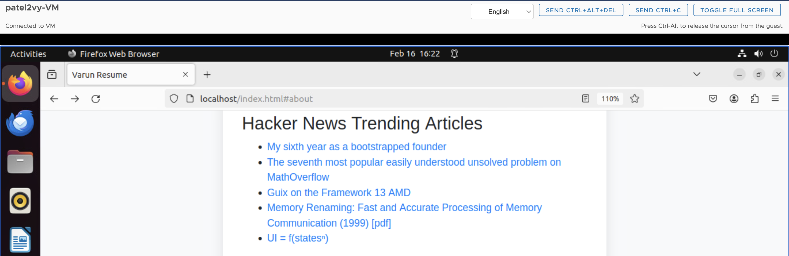
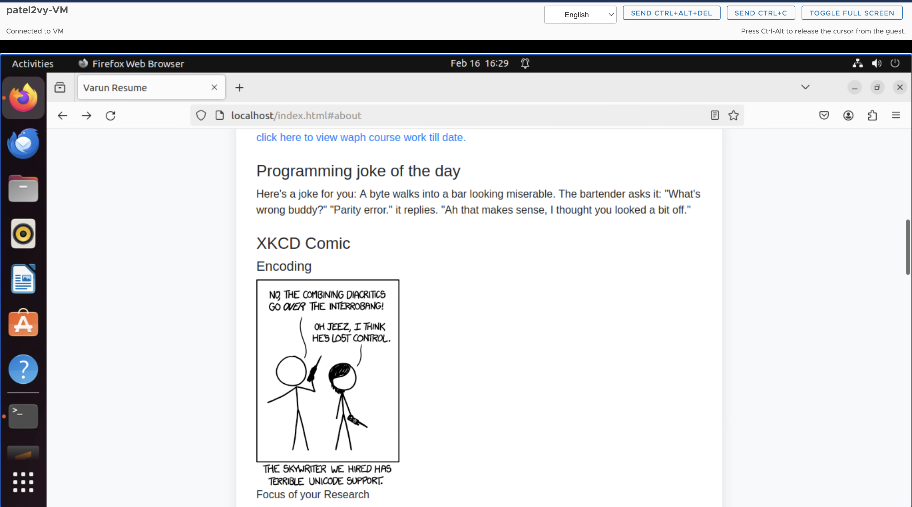
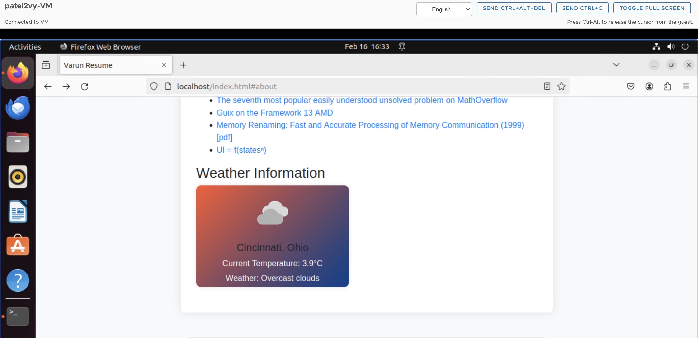
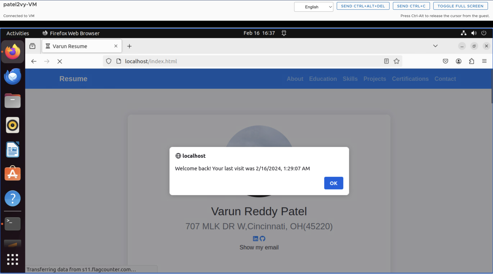

# WAPH-Web Application Programming and Hacking

## Instructor: Dr. Phu Phung

## Student

**Name**: Varun Reddy Patel

**Email**: patel2vy@mail.uc.edu


## Repository Information

Respository's URL: [https://github.com/patel2vy/patel2vy.github.io](https://github.com/patel2vy/patel2vy.github.io)

This is a public repository for Varun Reddy to store all code from the course. The organization of this repository is as follows.

# Individual Project 1 – Front-end Web Development with a Professional Profile Website on github.io cloud service

## Overview and Requirements 

For Individual Project 1, I created a professional profile webpage and hosted it on GitHub. The website showcases my resume, about, skills, and projects,as well as many technological functions such as integrating a joke API, digital clock, analogue clock, displaying my email address, XKCD comic, Hacker News articles, weather API, and flag counter. The primary goals of this project were to improve my front-end web programming abilities and get actual experience deploying websites with GitHub Sites.

The link to access my website is: [https://patel2vy.github.io/index.html](https://patel2vy.github.io/index.html).

The link to access Individual Project-1 is: [https://github.com/patel2vy/patel2vy.github.io](https://github.com/patel2vy/patel2vy.github.io).

## General Requirements

### Personal Website on Github.io

I have open-sourced a new repository called `patel2vy.github.io`. I used GitHub Pages to create a personal website including my resume, contact details, education, certifications, projects, and skills.

The link to access my website is: [https://patel2vy.github.io/index.html](https://patel2vy.github.io/index.html).



### "Web Application Programming and Hacking" course on waph.html file

I made a stand-alone page on my repository called waph.html to introduce the "Web Application Programming and Hacking" course and the practical projects that go along with it. A summary of Lab0, Lab1, Lab2, Hackathon 1, and Individual Project 1 are included in this. 

The link to access waph.html is: [https://patel2vy.github.io/waph.html](https://patel2vy.github.io/waph.html).

This page URL is available via the personal website, as shown in the picture below.




## Non-technical requirements

I have created my own template taking references from we schools


### Page Tracker

In order to track website visits and interaction, I included Flag Counter as a page tracker. 

Based on the two provided websites. `https://flagcounter.com/` is my choice. I used the website to produce a key, which I then included into my code. The integrated flag counter is accessible on the homepage of my website.

Code for integrating Flag Counter:

```html
div style="text-align:left;">
    <a href="https://info.flagcounter.com/szVl"></a>
  </div>
```



## Technical requirements

### show/hide your email; A digital clock; An analog clock:

Similar to lab 2, we implemented an analogue and digital clock that displays the current time using JavaScript. We also included code that allows us to reveal or conceal the email address based on user input.

Source Code for show/hide your email:

```JS
function showhideEmail() {
      if (shown) {
        document.getElementById('email').innerHTML = "Click here to show my email";
        shown = false;
      }
      else {
        var myemail = "<a href='mailto:sheelada" + "@" + "mail.uc.edu'>sheelada" + "@" + "mail.uc.edu</a>";
        document.getElementById('email').innerHTML = myemail;
        shown = true;
```

Source Code for digital clock:
```JS
function displayTime() {
          document.getElementById('digital-clock').innerHTML = "current time:" + new Date();
        }
        setInterval(displayTime, 500);
```

Source Code for Analog clock:
```JS
var canvas = document.getElementById("analog-clock");
        var ctx = canvas.getContext("2d");
        var radius = canvas.height / 2;
        ctx.translate(radius, radius);
        radius = radius * 0.90
        setInterval(drawClock, 1000);

        function drawClock() {
          drawFace(ctx, radius);
          drawNumbers(ctx, radius);
          drawTime(ctx, radius);
        }
```

Screenshot Showing hide your email, Digital clock, Analog Clock:



### Two more Functionality of my choice

I have used the `VUE.JS` Framework to integrate Hacker News Api. Five Hacker News Articles are shown using this API. 

Source code for Haacker Api:
```JS
<script src="https://cdn.jsdelivr.net/npm/vue@2"></script>
```
 ```JS
<script>
          new Vue({
            el: '#app',
            data: {
              articles: []
            },
            mounted() {
              this.fetchArticles();
            },
            methods: {
              fetchArticles() {
                fetch('https://hacker-news.firebaseio.com/v0/topstories.json')
                  .then(response => response.json())
                  .then(ids => {
                    // Take only the first 10 article IDs
                    ids = ids.slice(0, 5);
                    // Fetch details of each article
                    Promise.all(ids.map(id =>
                      fetch(`https://hacker-news.firebaseio.com/v0/item/${id}.json`)
                        .then(response => response.json())
                    ))
                      .then(articles => {
                        // Update articles data
                        this.articles = articles;
                      });
                  })
                  .catch(error => console.error('Error fetching articles:', error));
              }
            }
          });
        </script>
 ```


### Joke API

Incorporated the jokeAPI to retrieve a fresh joke every 60 seconds and post it online.

Source code for Joke API:

```JS
function fetchJoke() {
          $.get("https://v2.jokeapi.dev/joke/Any?type=single", function (result) {
            console.log("From jokeAPI: " + JSON.stringify(result));
            if (result && result.joke) {
              $("#joke").text("Here's a joke for you: " + result.joke);
            } else {
              $("#joke").text("Could not retrieve a joke at the moment.");
            }
          });
        }

fetchJoke();
setInterval(fetchJoke, 60000);
```

### XKCD Comic API

Incorporated the XKCD Comic API using the api `https://xkcd.com/info.0.json`

Source code for Joke API:

```JS
function fetchComic() {
                const proxyUrl = "https://api.allorigins.win/raw?url=";
                const apiUrl = "https://xkcd.com/info.0.json";

                fetch(proxyUrl + apiUrl)
                    .then(response => response.json())
                    .then(data => {
                        document.getElementById("comic-title").textContent = "Title: " + data.title;
                        document.getElementById("comic-img").src = data.img;
                        document.getElementById("comic-alt").textContent = data.alt;
                    })
                    .catch(error => {
                        console.error("Error fetching XKCD comic:", error);
                    });
            }
            fetchComic();
```


### Weather API

The website has integrated the Weatherbit API to retrieve up-to-date weather data of our current location (Cincinnati) and present it.

```JS

$(document).ready(function () {
    // Fetch data from Weatherbit API
    $.ajax({
        url: "https://api.weatherbit.io/v2.0/current",
        data: {
            city: "cincinnati",
            key: "9dfcc371ce9e44f38aa65500af54f3c0" // Replace with your Weatherbit API key
        },
        success: function(data) {
            // Extract relevant weather information
            var temperature = data.data[0].temp;
            var description = data.data[0].weather.description;
            var iconCode = data.data[0].weather.icon;

            // Update weather information
            $("#temperature").text(temperature + "°C");
            $("#description").text(description);

            // Update weather icon
            $("#weather-icon").attr("src", "https://www.weatherbit.io/static/img/icons/" + iconCode + ".png");
            $("#weather-icon").attr("alt", description);
        },
        error: function(xhr, status, error) {
            console.error("Error fetching weather:", error);
            $("#temperature").text("Error");
            $("#description").text("Error fetching weather");
        }
    });
});
```


### Javascript Cookies

JavaScript cookies were used to remember the client's visit and provide customized messages according to the client's recurring or first-time status. When a person visits for the first time, it says "Welcome to my homepage!" and when they return, it says "Welcome back! (Last visit time and date) was when you last visited.

```JS
    function setCookie(name, value, days) {
      var expires = "";
      if (days) {
        var date = new Date();
        date.setTime(date.getTime() + (days * 24 * 60 * 60 * 1000));
        expires = "; expires=" + date.toUTCString();
      }
      document.cookie = name + "=" + (value || "") + expires + "; path=/";
    }

    function getCookie(name) {
      var nameEQ = name + "=";
      var ca = document.cookie.split(';');
      for (var i = 0; i < ca.length; i++) {
        var c = ca[i];
        while (c.charAt(0) === ' ') c = c.substring(1, c.length);
        if (c.indexOf(nameEQ) === 0) return c.substring(nameEQ.length, c.length);
      }
      return null;
    }

    // Function to display the welcome message
    function displayWelcomeMessage() {
      var lastVisit = getCookie("lastVisit");
      if (!lastVisit) {
        // First-time visit
        setCookie("lastVisit", new Date().toISOString(), 30); // Set cookie to expire in 30 days
        alert("Welcome to my homepage!");
      } else {
        // Returning visit
        var lastVisitDate = new Date(lastVisit);
        alert("Welcome back! Your last visit was " + lastVisitDate.toLocaleString());
      }
    }

    // Call the function when the page loads
    window.onload = displayWelcomeMessage;
```

