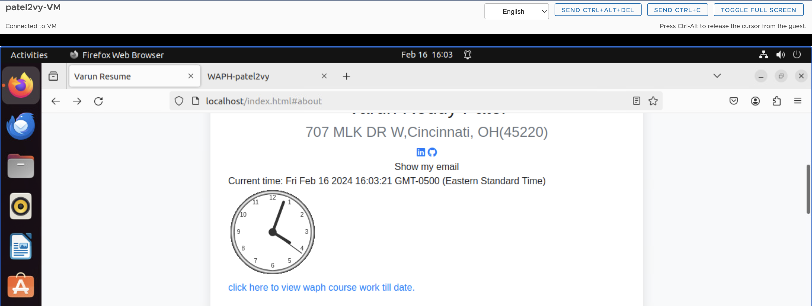

# WAPH-Web Application Programming and Hacking

## Instructor: Dr. Phu Phung

## Student

**Name**: Varun Reddy Patel

**Email**: patel2vy@mail.uc.edu


## Repository Information

Respository's URL: [https://github.com/patel2vy/patel2vy.github.io](https://github.com/patel2vy/patel2vy.github.io)

This is a public repository for Varun Reddy to store all code from the course. The organization of this repository is as follows.

# Individual Project 1 – Front-end Web Development with a Professional Profile Website on github.io cloud service

## Overview and Requirements 

For Individual Project 1, I created a professional profile webpage and hosted it on GitHub. The website showcases my resume, about, skills, and projects,as well as many technological functions such as integrating a joke API, digital clock, analogue clock, displaying my email address, XKCD comic, Hacker News articles, weather API, and flag counter. The primary goals of this project were to improve my front-end web programming abilities and get actual experience deploying websites with GitHub Sites.

The link to access my website is: [https://patel2vy.github.io/index.html](https://patel2vy.github.io/index.html).

The link to access Individual Project-1 is: [https://github.com/patel2vy/patel2vy.github.io](https://github.com/patel2vy/patel2vy.github.io).

## General Requirements

### Personal Website on Github.io

I have open-sourced a new repository called `patel2vy.github.io`. I used GitHub Pages to create a personal website including my resume, contact details, education, certifications, projects, and skills.

The link to access my website is: [https://patel2vy.github.io/index.html](https://patel2vy.github.io/index.html).


### "Web Application Programming and Hacking" course on waph.html file

I made a stand-alone page on my repository called waph.html to introduce the "Web Application Programming and Hacking" course and the practical projects that go along with it. A summary of Lab0, Lab1, Lab2, Hackathon 1, and Individual Project 1 are included in this. 

The link to access waph.html is: [https://patel2vy.github.io/waph.html](https://patel2vy.github.io/waph.html).

This page URL is available via the personal website, as shown in the picture below.




## Non-technical requirements

I have created my own template taking references from we schools


### Page Tracker

In order to track website visits and interaction, I included Flag Counter as a page tracker. 

Based on the two provided websites. `https://flagcounter.com/` is my choice. I used the website to produce a key, which I then included into my code. The integrated flag counter is accessible on the homepage of my website.

Code for integrating Flag Counter:

```html
div style="text-align:left;">
    <a href="https://info.flagcounter.com/szVl"></a>
  </div>
```


